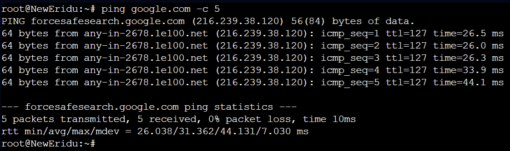

# DOKUMENTASI JARKOM PRAKTIKUM 5

## ANGGOTA

| Nama                        | NRP        |
| --------------------------- | ---------- |
| Dionisius Marcell Putra Indranto       | 5027231044 |
| Aswalia Novitriasari | 5027231012 |

## TOPOLOGY


## PEMBAGIAN IP


## NewEridu
```
auto eth0
iface eth0 inet dhcp

auto eth2
iface eth2 inet static
  address 192.235.0.1
  netmask 255.255.255.252
  
auto eth1
iface eth1 inet static
  address 192.235.0.5
  netmask 255.255.255.252

#A6
post-up route add -net 192.235.2.0 netmask 255.255.255.248 gw 192.235.0.2

#A3
post-up route add -net 192.235.0.8 netmask 255.255.255.248 gw 192.235.0.6

#A8
post-up route add -net 192.235.2.64 netmask 255.255.255.192 gw 192.235.0.2

#A7
post-up route add -net 192.235.2.8 netmask 255.255.255.248 gw 192.235.0.2

#A4
post-up route add -net 192.235.0.128 netmask 255.255.255.128 gw 192.235.0.6

#A5
post-up route add -net 192.235.1.0 netmask 255.255.255.0 gw 192.235.0.6

#A9
post-up route add -net 192.235.2.128 netmask 255.255.255.252 gw 192.235.0.2
```

## SixStreet (DHCP Relay)
```
auto eth0
iface eth0 inet static
  address 192.235.0.2
  netmask 255.255.255.252
  gateway 192.235.0.1

auto eth1
iface eth1 inet static
  address 192.235.2.1
  netmask 255.255.255.248

auto eth2
iface eth2 inet static
  address 192.235.2.9
  netmask 255.255.255.248

up echo nameserver 192.168.122.1 > /etc/resolv.conf

#A8
post-up route add -net 192.235.2.64 netmask 255.255.255.192 gw 192.235.2.3

#A9
post-up route add -net 192.235.2.128 netmask 255.255.255.252 gw 192.235.2.2

#A4
post-up route add -net 192.235.0.128 netmask 255.255.255.128 gw 192.235.0.1
```
## HDD (DNS)
```
auto eth0
iface eth0 inet static
  address 192.235.2.10
  netmask 255.255.255.248
  gateway 192.235.2.9

up echo nameserver 192.168.122.1 > /etc/resolv.conf
```

## Fairy (DHCP)
```
auto eth0
iface eth0 inet static
  address 192.235.2.11
  netmask 255.255.255.248
  gateway 192.235.2.9

up echo nameserver 192.168.122.1 > /etc/resolv.conf

#A8
post-up route add -net 192.235.2.16 netmask 255.255.255.192 gw 192.235.2.9

#A4
post-up route add -net 192.235.0.128 netmask 255.255.255.128 gw 192.235.2.9
```

## OuterRing (DHCP Relay)
```
auto eth0
iface eth0 inet static
  address 192.235.2.3
  netmask 255.255.255.248
  gateway 192.235.2.1

auto eth1
iface eth1 inet static
  address 192.235.2.65
  netmask 255.255.255.192

up echo nameserver 192.168.122.1 > /etc/resolv.conf

#A9
post-up route add -net 192.235.2.128 netmask 255.255.255.252 gw 192.235.2.2

#A1
post-up route add -net 192.235.0.0 netmask 255.255.255.252 gw 192.235.2.1

#A7
post-up route add -net 192.235.2.8 netmask 255.255.255.248 gw 192.235.2.1
```

## Burnice (Client)
```
auto eth0
iface eth0 inet dhcp

#Hollowzero
post-up route add -net 192.235.2.128 netmask 255.255.255.252 gw 192.235.2.65

#A1
post-up route add -net 192.235.0.0 netmask 255.255.255.252 gw 192.235.2.65
```

## Caesar (Client)
```
auto eth0
iface eth0 inet dhcp

#Hollowzero
post-up route add -net 192.235.2.128 netmask 255.255.255.252 gw 192.235.2.65

#A1
post-up route add -net 192.235.0.0 netmask 255.255.255.252 gw 192.235.2.65
```

## LuminaSquare (DCHP Relay)
```
auto eth0
iface eth0 inet static
  address 192.235.0.6
  netmask 255.255.255.252
  gateway 192.235.0.5

auto eth1
iface eth1 inet static
  address 192.235.0.9
  netmask 255.255.255.248
 
auto eth2
iface eth2 inet static
  address 192.235.1.1
  netmask 255.255.255.0

up echo nameserver 192.168.122.1 > /etc/resolv.conf

#A1
post-up route add -net 192.235.0.0 netmask 255.255.255.252 gw 192.235.0.5

#A4
post-up route add -net 192.235.0.128 netmask 255.255.255.128 gw 192.235.0.11

#A7
post-up route add -net 192.235.2.8 netmask 255.255.255.248 gw 192.235.0.5
```

## Jane (Client)
```
auto eth0
iface eth0 inet dhcp
```

## Policeboo (Client)
```
auto eth0
iface eth0 inet dhcp
```

## HIA (Web Server)
```
auto eth0
iface eth0 inet static
  address 192.235.0.10
  netmask 255.255.255.248
  gateway 192.235.0.9
 
up echo nameserver 192.168.122.1 > /etc/resolv.conf
```

## HollowZero (Web Server)
```
auto eth0
iface eth0 inet static
  address 192.235.2.130
  netmask 255.255.255.252
  gateway 192.235.2.129

up echo nameserver 192.168.122.1 > /etc/resolv.conf

#A1
post-up route add -net 192.235.0.0 netmask 255.255.255.252 gw 192.235.2.129
```

## BalletTwins (DHCP Relay)
```
auto eth0
iface eth0 inet static
  address 192.235.0.11
  netmask 255.255.255.248
  gateway 192.235.0.9
 
auto eth1
iface eth1 inet static
  address 192.235.0.129
  netmask 255.255.255.128

up echo nameserver 192.168.122.1 > /etc/resolv.conf
 
#A2
post-up route add -net 192.235.0.4 netmask 255.255.255.252 gw 192.235.0.9

#A1
post-up route add -net 192.235.0.0 netmask 255.255.255.252 gw 192.235.0.9

#A7
post-up  route add -net 192.235.2.8 netmask 255.255.255.248 gw 192.235.0.9
```

## Ellen (Client)
```
auto eth0
iface eth0 inet dhcp 
```

## Lycaon (Client)
```
auto eth0
iface eth0 inet dhcp 
```

## ScootOutpost
```
auto eth0
iface eth0 inet static
  address 192.235.2.2
  netmask 255.255.255.248
  gateway 192.235.2.1

auto eth1
iface eth1 inet static
  address 192.235.2.129
  netmask 255.255.255.252

up echo nameserver 192.168.122.1 > /etc/resolv.conf

#A2
post-up route add -net 192.235.0.4 netmask 255.255.255.252 gw 192.235.2.1

#A8
post-up route add -net 192.235.2.16 netmask 255.255.255.192 gw 192.235.2.3

#A1
post-up  route add -net 192.235.0.0 netmask 255.255.255.252 gw 192.235.2.1
```

# Steps
## PREREQUESITE
Run setup.sh on NewEridu, Pastikan masing-masing nodes memiliki nameserver 192.168.122.1 di /etc/resolv.conf
```
echo net.ipv4.ip_forward=1 >/etc/sysctl.conf
sysctl -p

ETH0_IP=$(ip -4 addr show eth0 | grep -oP '(?<=inet\s)\d+(\.\d+){3}')
iptables -t nat -A POSTROUTING -o eth0 -j SNAT --to-source $ETH0_IP
```
Lalu, tes dengan melakukan ping google.com di NewEridu, SixStreet, OuterRing, Fairy



## CONFIG DHCP
Jalankan setup.sh di Fairy
```
export DEBIAN_FRONTEND=noninteractive
apt update
apt install isc-dhcp-server netcat -y
cp ~/dhcpd.conf /etc/dhcp/dhcpd.conf
cp ~/isc-dhcp-server /etc/default/isc-dhcp-server
echo INTERFACESv4=\"eth0\" >/etc/default/isc-dhcp-server
service rsyslog start

service isc-dhcp-server start
```
Jalankan setup.sh di seluruh DHCP Relay
```
echo net.ipv4.ip_forward=1 >/etc/sysctl.conf
sysctl -p

export DEBIAN_FRONTEND=noninteractive
apt update
apt install isc-dhcp-relay netcat -y
cp ~/isc-dhcp-relay /etc/default/isc-dhcp-relay

service isc-dhcp-relay start
service rsyslog start
```
Lalu restart seluruh client


## NO 2 FAIRY
Cek iptables menggunakan command ```iptables -L INPUT -n --line-numbers```
Lalu, masukkan command ```iptables -A INPUT -p icmp --icmp-type echo-request -j DROP```
Test dengan melakukan ping terhadap ScootOutpost (192.235.2.129) dari Fairy (192.235.2.11) dimana Fairy bisa mengakses ScootOutpost tapi ScootOutpost tidak bisa mengakses Fairy


## NO 3 HDD
Pastikan HDD bisa melakukan ping ke seluruh nodes
Jalankan setup.sh di HDD
```
export DEBIAN_FRONTEND=noninteractive
apt update
apt install bind9 netcat -y
cp ~/named.conf.options /etc/bind/named.conf.options

service bind9 restart
```
Lalu jalankan command iptables ```iptables -P INPUT DROP``` dan ```iptables -A INPUT -s 192.235.2.11 -j ACCEPT```
Lalu lakukan testing terhadap Fairy(192.235.2.11) dari HDD(192.235.2.10) dimana Fairy bisa mengakses HDD tapi HDD tidak bisa mengakses Fairy


Setelah melakukan testing jalankan command ```iptables -F``` untuk menghapus semua rule yang telah dibuat

## NO 4 HollowZero
Jalankan setup.sh di HollowZero
```
export DEBIAN_FRONTEND=noninteractive
apt update
apt install apache2 -y
cp ~/index.html /var/www/html/index.html
cp ~/000-default.conf /etc/apache2/sites-available/000-default.conf
service apache2 restart
```
Lalu coba untuk melakukan pengecekan terhadap web yang ada menggunakan command ```curl localhost```
Jalankan command iptables ```iptables -P INPUT DROP```, ```iptables -A INPUT -s 192.235.2.64/26 -m time --weekdays Mon,Tue,Wed,Thu,Fri -j ACCEPT``` dan ```iptables -A INPUT -s 192.235.1.0/24 -m time --weekdays Mon,Tue,Wed,Thu,Fri -j ACCEPT```
Lalu lakukan testing terhadap client


## NO 5 HIA
Jalankan command setup.sh pada HIA
```
export DEBIAN_FRONTEND=noninteractive
apt update
apt install apache2 -y
cp ~/index.html /var/www/html/index.html
cp ~/000-default.conf /etc/apache2/sites-available/000-default.conf
service apache2 restart
```
Lalu jalankan command iptables ```iptables -P INPUT DROP```, ```iptables -A INPUT -s 192.235.0.128/25 -m time --timestart 08:00 --timestop 21:00 -j ACCEPT```dan ```iptables -A INPUT -s 192.235.1.0/24 -m time --timestart 03:00 --timestop 23:00 -j ACCEPT```
Lakukan testing dengan command ```curl 192.235.0.10```


## NO 6 HIA PORTSCAN
Jalankan command iptables 
```
#Create a chain for handling port scanning
iptables -N PORTSCAN

#Detect and handle new connections to ports 1-100
iptables -I INPUT 1 -j LOG --log-prefix "PORT SCAN BRO: " --log-level 4 --log-tcp-options --log-ip-options
iptables -A INPUT -p tcp --dport 1:100 -m state --state NEW -m recent --set --name portscan
iptables -A INPUT -p tcp --dport 1:100 -m state --state NEW -m recent --update --seconds 10 --hitcount 25 --name portscan -j PORTSCAN

#Log and block port-scanning IPs
iptables -A PORTSCAN -m recent --set --name blacklist
iptables -I PORTSCAN 1 -j LOG --log-prefix "PORT SCAN DETECTED: " --log-level 4 --log-tcp-options --log-ip-options
iptables -A PORTSCAN -j DROP

#Block all further traffic from blacklisted IPs
iptables -A INPUT -m recent --name blacklist --rcheck -j DROP
iptables -A OUTPUT -m recent --name blacklist --rcheck -j DROP
```
Lalu test menggunakan ```curl 192.235.0.10``` lalu lakukan nmap ```nmap -p 1-100 192.235.0.10``` Lalu test lagi menggunakan ```curl 192.235.0.10``` maka akan terdeteksi port scan pada client tersebut dan tidak diblokir dari akses HIA


## NO 7 HollowZero
Jalankan command iptables 
```
iptables -A INPUT -p tcp --dport http -m conntrack --ctstate NEW -m recent --set
iptables -A INPUT -p tcp --dport http -m conntrack --ctstate NEW -m recent --update --seconds 1 --hitcount 3 -j REJECT
iptables -A INPUT -p tcp --dport http -j ACCEPT
```
Lalu lakukan testing dengan melakukan command ```parallel curl -s 192.235.2.130 ::: IPCLIENT IPCLIENT IPCLIENT IPCLIENT```


## NO 8 Burnice
Jalankan setup.sh di Burnice
```
iptables -t nat -A PREROUTING -p tcp --dport 12345 -j DNAT --to-destination 192.235.2.130
iptables -t nat -A POSTROUTING -p tcp --dport 12345 -j MASQUERADE
```
Lalu lakukan testing dengan melakukan command ```nc -l -p 12345``` di Burnice dan gunakan command ```echo "Hai, Aku Fairy" | nc IPBURNICE 12345``` di Fairy


## MISI 3
Lakukan instalasi netcat pada Burnice dengan command ```apt update && apt install netcat -y```
Lalu jalankan command ```nc -l -p 77777``` di Burnice
Lalu kirimkan pesan ke Burnice dari Fairy dengan command ```echo "Kepercayaan adalah dasar dari jaringan yang aman. Jangan pernah mengkhianatinya." | nc IPBURNICE 77777```


Lalu jalankan command iptables 
```
iptables -P INPUT DROP
iptables -P OUTPUT DROP
iptables -P FORWARD DROP
```
