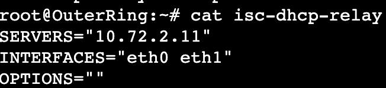

# DOKUMENTASI JARKOM PRAKTIKUM 5

## BLOM SELESAI

## ANGGOTA

| Nama                        | NRP        |
| --------------------------- | ---------- |
| Athalla Barka Fadhil        | 5027231018 |
| Jody Hezekiah Tanasa Sagala | 5027221050 |

## NOTES
Config ada di folder devices, tinggal masukin aja semuanya ke /root
kalo gaada confignya di folder devices, berarti emg gaada confignya

## TOPOLOGY


## PEMBAGIAN IP


## NewEridu
```
auto eth0
iface eth0 inet dhcp

auto eth1
iface eth1 inet static
  address 10.72.0.1
  netmask 255.255.255.252
  
auto eth2
iface eth2 inet static
  address 10.72.0.5
  netmask 255.255.255.252

#A6
post-up route add -net 10.72.2.0 netmask 255.255.255.248 gw 10.72.0.2

#A3
post-up route add -net 10.72.0.8 netmask 255.255.255.248 gw 10.72.06

#A8
post-up route add -net 10.72.2.64 netmask 255.255.255.192 gw 10.72.0.2

#A7
post-up route add -net 10.72.2.8 netmask 255.255.255.248 gw 10.72.0.2

#A4
post-up route add -net 10.72.0.128 netmask 255.255.255.128 gw 10.72.0.6

#A5
post-up route add -net 10.72.1.0 netmask 255.255.255.0 gw 10.72.0.6

#A9
post-up route add -net 10.72.2.128 netmask 255.255.255.252 gw 10.72.0.2
```

## SixStreet (DHCP Relay)
```
auto eth0
iface eth0 inet static
  address 10.72.0.2
  netmask 255.255.255.252
  gateway 10.72.0.1

auto eth1
iface eth1 inet static
  address 10.72.2.1
  netmask 255.255.255.248

auto eth2
iface eth2 inet static
  address 10.72.2.9
  netmask 255.255.255.248

up echo nameserver 192.168.122.1 > /etc/resolv.conf

#A8
post-up route add -net 10.72.2.64 netmask 255.255.255.192 gw 10.72.2.3

#A9
post-up route add -net 10.72.2.128 netmask 255.255.255.252 gw 10.72.2.2

#A4
post-up route add -net 10.72.0.128 netmask 255.255.255.128 gw 10.72.0.1
```
## HDD (DNS)
```
auto eth0
iface eth0 inet static
  address 10.72.2.10
  netmask 255.255.255.248
  gateway 10.72.2.9

up echo nameserver 192.168.122.1 > /etc/resolv.conf
```

## Fairy (DHCP)
```
auto eth0
iface eth0 inet static
  address 10.72.2.11
  netmask 255.255.255.248
  gateway 10.72.2.9

up echo nameserver 192.168.122.1 > /etc/resolv.conf

#A8
post-up route add -net 10.72.2.16 netmask 255.255.255.192 gw 10.72.2.9

#A4
post-up route add -net 10.72.0.128 netmask 255.255.255.128 gw 10.72.2.9
```

## OuterRing (DHCP Relay)
```
auto eth0
iface eth0 inet static
  address 10.72.2.3
  netmask 255.255.255.248
  gateway 10.72.2.1

auto eth1
iface eth1 inet static
  address 10.72.2.65
  netmask 255.255.255.192

up echo nameserver 192.168.122.1 > /etc/resolv.conf

#A9
post-up route add -net 10.72.2.128 netmask 255.255.255.252 gw 10.72.2.2

#A1
post-up route add -net 10.72.0.0 netmask 255.255.255.252 gw 10.72.2.1

#A7
post-up route add -net 10.72.2.8 netmask 255.255.255.248 gw 10.72.2.1
```

## Burnice (Client)
```
auto eth0
iface eth0 inet dhcp

#Hollowzero
post-up route add -net 10.72.2.128 netmask 255.255.255.252 gw 10.72.2.65

#A1
post-up route add -net 10.72.0.0 netmask 255.255.255.252 gw 10.72.2.65
```

## Caesar (Client)
```
auto eth0
iface eth0 inet dhcp

#Hollowzero
post-up route add -net 10.72.2.128 netmask 255.255.255.252 gw 10.72.2.65

#A1
post-up route add -net 10.72.0.0 netmask 255.255.255.252 gw 10.72.2.65
```

## LuminaSquare (DCHP Relay)
```
auto eth0
iface eth0 inet static
  address 10.72.0.6
  netmask 255.255.255.252
  gateway 10.72.0.5

auto eth1
iface eth1 inet static
  address 10.72.0.9
  netmask 255.255.255.248
 
auto eth2
iface eth2 inet static
  address 10.72.1.1
  netmask 255.255.255.0

up echo nameserver 192.168.122.1 > /etc/resolv.conf

#A1
post-up route add -net 10.72.0.0 netmask 255.255.255.252 gw 10.72.0.5

#A4
post-up route add -net 10.72.0.128 netmask 255.255.255.128 gw 10.72.0.11

#A7
post-up route add -net 10.72.2.8 netmask 255.255.255.248 gw 10.72.0.5
```

## Jane (Client)
```
auto eth0
iface eth0 inet dhcp
```

## Policeboo (Client)
```
auto eth0
iface eth0 inet dhcp
```

## HIA (Web Server)
```
auto eth0
iface eth0 inet static
  address 10.72.0.10
  netmask 255.255.255.248
  gateway 10.72.0.9
 
up echo nameserver 192.168.122.1 > /etc/resolv.conf
```

## HollowZero (Web Server)
```
auto eth0
iface eth0 inet static
  address 10.72.2.130
  netmask 255.255.255.252
  gateway 10.72.2.129

up echo nameserver 192.168.122.1 > /etc/resolv.conf

#A1
post-up route add -net 10.72.0.0 netmask 255.255.255.252 gw 10.72.2.129
```

## BalletTwins (DHCP Relay)
```
auto eth0
iface eth0 inet static
  address 10.72.0.11
  netmask 255.255.255.248
  gateway 10.72.0.9
 
auto eth1
iface eth1 inet static
  address 10.72.0.129
  netmask 255.255.255.128

up echo nameserver 192.168.122.1 > /etc/resolv.conf
 
#A2
post-up route add -net 10.72.0.4 netmask 255.255.255.252 gw 10.72.0.9

#A1
post-up route add -net 10.72.0.0 netmask 255.255.255.252 gw 10.72.0.9

#A7
post-up  route add -net 10.72.2.8 netmask 255.255.255.248 gw 10.72.0.9
```

## Ellen (Client)
```
auto eth0
iface eth0 inet dhcp 
```

## Lycaon (Client)
```
auto eth0
iface eth0 inet dhcp 
```

## ScootOutpost
```
auto eth0
iface eth0 inet static
  address 10.72.2.2
  netmask 255.255.255.248
  gateway 10.72.2.1

auto eth1
iface eth1 inet static
  address 10.72.2.129
  netmask 255.255.255.252

up echo nameserver 192.168.122.1 > /etc/resolv.conf

#A2
post-up route add -net 10.72.0.4 netmask 255.255.255.252 gw 10.72.2.1

#A8
post-up route add -net 10.72.2.16 netmask 255.255.255.192 gw 10.72.2.3

#A1
post-up  route add -net 10.72.0.0 netmask 255.255.255.252 gw 10.72.2.1
```

# TUTORIAL
## PREREQUESITE

1. UDAH SUBNET DAN SUDAH ROUTING DAN UDAH BISA PING KE SEMUA NODES BARU LANJUT CONFIG 
2. Setup nameserver 192.168.122.1nya, masuk web console NewEridu trus run setup.sh


jangan lupa buat setiap nodes harus ada nameserver kyk dibawah ini


3. coba ping x.com dari NewEridu,SixStreet, OuterRing, Fairy


## CONFIG DHCP
Disini tutorial buat config DHCPnya OuterRing dulu
1. Copy config dari folder devices buat NewEridu, SixStreet, OuterRing, Fairy
2. Masuk ke web console Fairy trus run setup.sh


3. Masuk web console SixStreet trus run setup.sh trus biar pasti, run `service isc-dhcp-relay restart`


4. Masuk web console OuterRing trus run setup.sh trus biar pasti, run `service isc-dhcp-relay restart`


5. Jangan lupa buat ganti IP dibawah ini pake IP dari DHCP Server (Fairy)

6. Coba masuk web console Fairy trus coba
`service isc-dhcp-server restart`

7. Coba restart clientnya, di stop trus start lagi misal si Caesar trus masuk web consolenya

trus coba liat juga di web console Fairy
`tail -f /var/log/syslog`

disini keliatan ada log ip 10.72.2.69 berhasil di lease ke Caesar
8. Kalo kyk gini udah bener berarti DHCPnya

## CONFIG WEB SERVER
1. copy config dari folder devices buat 

## NO 2 FAIRY
1. web console Fairy trus cat setup.sh
copy yang command iptables paling bawah


2. cek iptables dulu (blom ada apa2)


3. 
`iptables -A INPUT -p icmp --icmp-type echo-request -j DROP`
 

 4. fairy bisa ping ScootOutpost (10.72.2.129)
  

  tapi ScootOutpost gabisa ping fairy (10.72.2.11)
  

## NO 3 HDD
pasitiin HDD ini bisa ping ke semua nodes 
1. web console HDD trus cat setup.sh
copy


2. liat command iptables dipaling bawah


3. cek aturan sekarang (blom ada apa2) 
`iptables -L INPUT -n --line-numbers`


4. Bikin aturan untuk blok semua request 
`iptables -A INPUT DROP`


5. lalu buat aturan agar hanya Fairy (10.72.2.11) yang bisa akses
`iptables -A INPUT -s 10.72.2.11 -j ACCEPT`


6. fairy bisa ping ke HDD

tapi nodes lain gabisa ping ke HDD


7. test pake netcat 


terlihat bahwa fairy bisa ping nc tapi yang lain gabisa ping nc

## NO 4 HollowZero
1. masuk web console HollowZero trus run setup.sh


2. trus cek buat nyoba webservernya


3. cek command iptables paling bawah


4. `date` buat liat tanggal sekarang, trus jalanin 3 command iptables dibawah
  

5. Caesar ga bisa ping ke HollowZero soalnya sekarang hari sabtu 


6. ganti aturan agar sabtu bisa diakses

drop aturan no 2 (yang 10.72.2.64 pokoknya)
`iptables -D INPUT 2`
`iptables -A INPUT -s 10.72.2.64/26 -m time --weekdays Sat -j ACCEPT`
kita allow hari sabtu


7. Caesar bisa ping dan curl ke HollowZero

## NO 5 HIA
1. web console HIA trus run setup.sh

2. cek buat nyoba webservernya

3. jalanin iptables dibawah

4. 
    a.  `iptables -P INPUT DROP`
    b. `iptables -A INPUT -s 10.72.0.128/25 -m time --timestart 08:00 --timestop 21:00 -j ACCEPT`
    c. `iptables -A INPUT -s 10.72.1.0/24 -m time --timestart 03:00 --timestop 23:00 -j ACCEPT`

5. Lycaon bisa akses karena sekarang masih masuk kedalam waktu yang diperbolehkan
